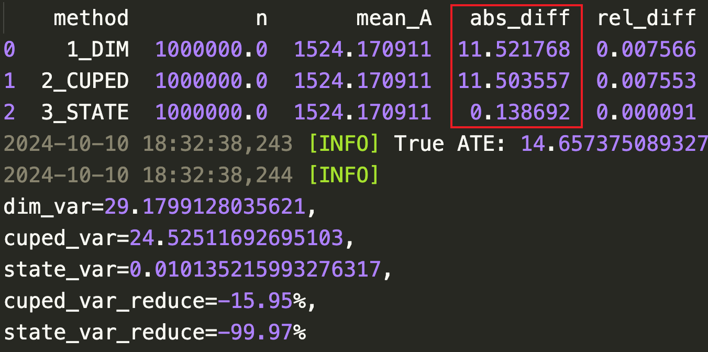

# survey_state_variance_reduce

- 该项目对方差缩减论文[STATE: A Robust ATE Estimator of Heavy-Tailed Metrics for Variance Reduction in Online Controlled Experiments](https://arxiv.org/abs/2407.16337)进行了算法实现，并完成了模拟数据生成，分别对比DIM，CUPEC和STATE三种算法的效果
- 安装使用说明
    - 安装相关依赖包后，在工程目录下运行：python sim_main.py

- 初步模拟数据结论：
    - 当全体用户施加不同程度的effect，STATE的ATE是无偏估计，方差缩减程度非常高，达99%，这里和paper数据存在不一致。
         - 
         - 在10次simulation实验下取abs_diff均值，可以看到三种方法预估结果接近

    - 当构造仅对部分人群有不同程度的effect，构造局部人群异质性的场景下，STATE的ATE并非无偏估计，这里存在潜在未知风险，可能原因和算法实现有关系，也可能就是算法本身的局限性，待进一步讨论。
        - 
        - 同样也是10次simulation实验下取abs_diff均值，可以看到DIM和CUPEC方法预估ATE接近，STATE有比较明显的Bias